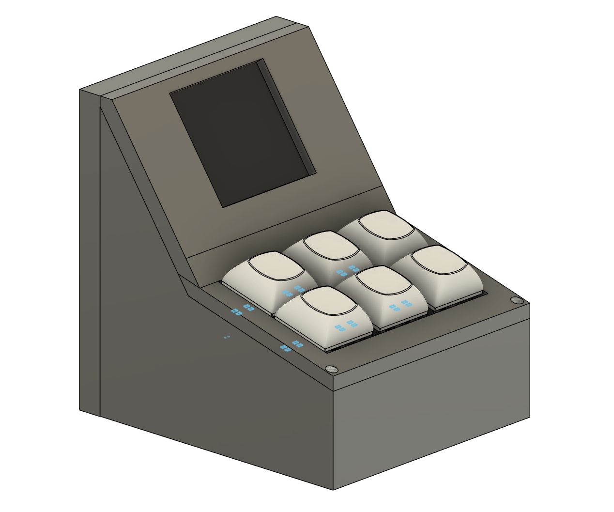
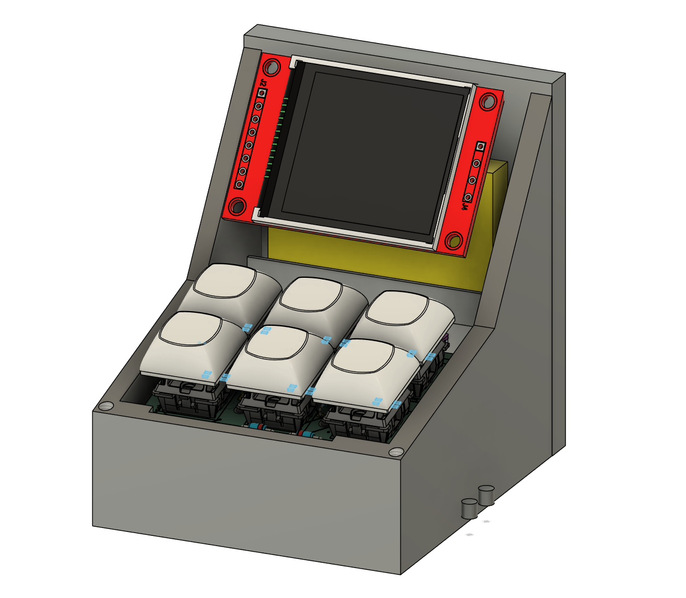
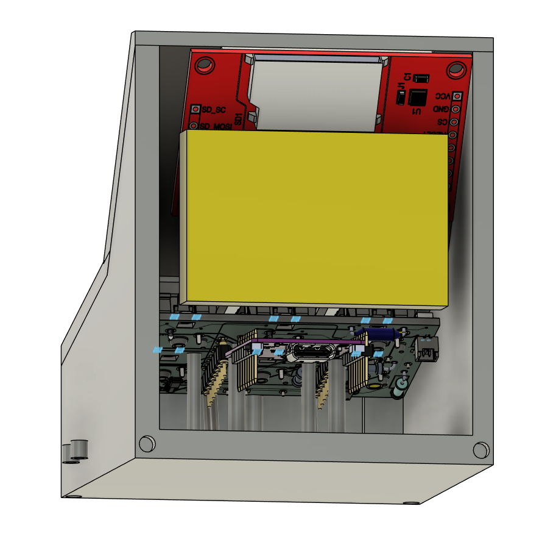

## **UNDER CONSTRUCTION**

# Sqrt(PC)
A mini PC helper with a battery, and a microcontroller powerful enough to run programs itself...

For now this repo will be kept simple, with just the bare essentials in it. If you want a more in-depth guide into my inner thought process and how things came together over time, and feel that the commit history is weak, please find the Blueprint link [here](https://blueprint.hackclub.com/projects/13283)

# BOM
[BOM](BOM.csv)

# Schematic

# PCB

# CAD

# Firmware
tbd

## Disclaimer
AI was used in this project, to sanity check and to learn.